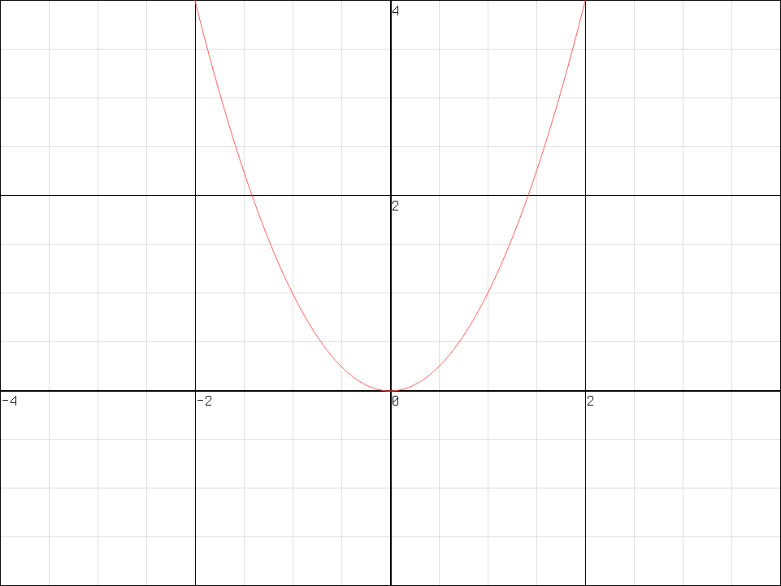
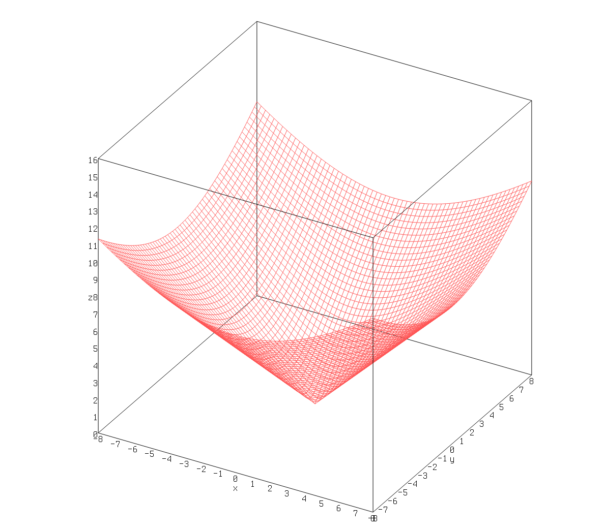
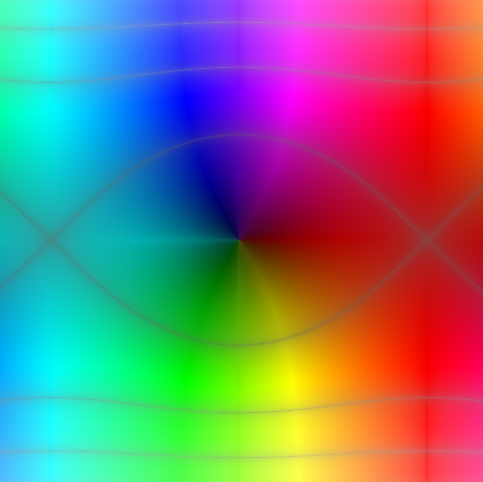

# rupl

a 2d/3d graphing library with support for complex numbers, 
focused on fast and simple interaface

with egui/skia backends

for example usage see [kalc-plot](https://github.com/bgkillas/kalc-plot)

